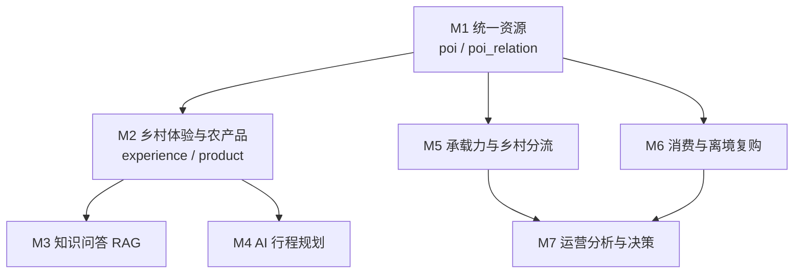

# 汉游智脑 · 模块划分与依赖关系

> 版本 v6 · 2026-09-26 · 随开发推进更新
> （v2：M2 完成，补 M2 接口与扩展点，修正 M1→M2 的依赖性质；
>   v3：新增 M8 认证与权限，M3 标为已验收，修正 M3 技术描述——实际实现是
>   「向量召回 + BM25 混合排序 + topic_gaps 拒答」，不是文档原先写的"Chroma 向量库"；
>   v4：新增 M9 媒体与配图管理，M8 前端接入完成；
>   v5：M3 完成**真实模型联调**验收（DeepSeek 对话 + 硅基流动 BAAI/bge-m3 嵌入），
>   补 M3 验收记录；修正 M3 前端页面名称（叫「文旅知识问答」，不叫「AI 助手」）；
>   v6：M3 问答架构调整——**DeepSeek 是回答模型，知识库降为增强来源**，
>   三条链路取代 `topic_gaps` 拒答；本节 M3 的"做什么"与降级口径、扩展点表已同步）

## 一、划分原则：纵切，不横切

每个模块是一条完整的竖线：

```
建表  →  后端接口  →  前端页面  →  前后端联调  →  验收  →  提交
```

上一模块验收通过后才启动下一模块。这样做的目的不是流程好看，而是避免
"前端全做完了、后端还没开始"这种跨模块半成品堆积——一旦某层返工，返工范围会扩散到所有模块。

配套三条纪律：

1. **不预建用不到的表**。数据库脚本按模块拆成 `db/V1__m1_*.sql`、`db/V2__m2_*.sql`，
   一个模块只建自己需要的表。表结构在真写接口时才定型，提前设计必然要改。
2. **切完即删 mock**。前端每个 mock 模块都对应一个后端模块，该模块落地后立即删除对应 mock，
   不留"两套数据源并存"的中间态。
   *执行记录*：M1 落地时保留了一半 mock（体验与产品仍读本地 `web/public/data/*.json`），
   因为那属于 M2 的范围；M2 落地时把 `api/citypack.ts` 里的 `loadLocal`、同步脚本
   `scripts/sync-citypack.mjs`、`web/public/data/` 与 `.gitignore` 里的对应条目一并删掉。
   现在前端唯一的数据来源是后端，后端唯一的数据来源是 `citypack/`。
3. **接口先留、页面后接**。后端接口的查询参数、关系类型按完整业务语义定义，
   即使当前前端没用到——否则后续模块要回头改接口，一改就牵动已验收的模块。

## 二、模块总览

| # | 模块 | 数据表 | 后端接口 | 前端页面 | 状态 |
|---|---|---|---|---|---|
| **M1** | 统一资源（POI） | `city_profile` `poi` `poi_relation` | `GET /api/city`<br>`GET /api/pois`<br>`GET /api/pois/{id}` | 探索页、资源详情页 | ✅ 已验收 |
| **M2** | 乡村体验与农产品 | `experience` `product` `product_category` | `GET /api/experiences`<br>`GET /api/experiences/{id}`<br>`GET /api/products`<br>`GET /api/products/{id}`<br>`GET /api/product-categories` | 详情页「乡村体验 / 乡村好物」、首页好物 | ✅ 已验收 |
| **M3** | 文旅知识问答（RAG） | Chroma `kb_city`（向量库，不占 MySQL） | `POST /api/ai/qa`（SSE，Java 代理）；`GET /api/ai/health`、`GET /api/ai/suggestions` | 文旅知识问答页（**刻意不叫「AI 助手」**，见该页注释） | ✅ 已验收（含真实模型联调） |
| **M4** | AI 行程规划（多智能体） | 阶段一二：`trip` `trip_context`；行程落库 `trip_plan` `trip_plan_item`（未建） | 已做 `POST /api/ai/agent`、`/api/trips/current`；原设计 `POST /ai/plan` 未实现 | AI 助手 · 行程规划、**互动地图**、我的行程 | **阶段一/二 + 地名解析 + 按天行程规划 + 对话持久化 + 互动地图 + `get_route`（两点驾车）已验收**；行程落库 `trip_plan` 未开始。★ `get_route` 是**通用两点**、**没和行程打通**（行程里仍无逐段车程、地图上仍无路线），见下方「阶段三的落地差异」 |
| **M5** | 承载力与乡村分流 | `poi_visit_stats` `risk_rule` `risk_event` `work_order` `diversion_notice` | 游客端 `GET /api/stats/pois`、`GET /api/diversion-notices`（均公开）<br>运营端 `GET /api/admin/ops/snapshot`、`POST /api/admin/ops/scan`<br>`GET /api/admin/risks`、`GET /api/admin/risks/{id}`、`POST /api/admin/risks/{id}/work-order`、`POST /api/admin/risks/{id}/notice`<br>`GET /api/admin/work-orders`、`PATCH /api/admin/work-orders/{id}`<br>`GET /api/admin/diversion-notices`、`PATCH /api/admin/diversion-notices/{id}` | 管理端「风险与工单」页（含「分流公告」标签页）、驾驶舱接真实数据、探索/行程/详情页承载与分流建议接真实承载、**首页告警条 + 详情页公告 banner** | ✅ 已验收 |
| **M6** | 消费与离境复购 | `cart_item` `orders` `order_item` `order_review` `trip_checkin`（本轮）<br>**原写** "`visitor`（待开发）"——**实际** `visitor` 不另建表，复用 M8 的 `app_user`（`trip_checkin.user_id -> app_user.id`，见 `db/V10__m6_trip_chain.sql` 文件头） | `GET/POST/PATCH/DELETE /api/cart`<br>`GET/POST /api/orders`、`GET /api/orders/count`<br>`POST /api/orders/{id}/pay\|cancel\|receipt\|refund\|review`<br>`POST /api/reviews/images`<br>`GET /api/admin/orders`、`PATCH /api/admin/orders/{id}/ship`、`POST /api/admin/orders/{id}/refund`<br>`GET /api/trips/current/checkins`、`POST /api/trips/current/checkins` | 乡村好物页、购物车、结算、我的订单、订单详情；运营端「订单处理」；游客端「我的足迹」、POI 详情页「我到过这里」按钮 | ✅ **三段已验收**：① 离境复购两态；② 七态订单流转；③ 到访消费 `TRIP` 链（足迹 + 渠道判定，**后端 34/34 + 前端 10/10**）。**未做**：分流公告写 `trip_checkin.source=DIVERSION` 的链路（即设计稿"分流贡献量"的写入方） |
| **M7** | 运营分析与决策 | 读 M5 / M6，不新建表 | `POST /api/admin/ops/analyze`（运营端，`hasRole("OPERATOR")`）<br>Python 侧对应 `POST /ai/analyze/ops`（回环 + 内部令牌） | 驾驶舱「AI 运营解读」面板：6 个维度切换 + 三段式 + 「依据」可核对 | ✅ 已验收 |
| **M8** | **认证与权限**（横切） | `app_user` `auth_email_code` | `POST /api/auth/code`<br>`POST /api/auth/register`<br>`POST /api/auth/login`<br>`GET /api/me`<br>`POST /api/me/logout` | 登录/注册页、路由守卫、请求头带令牌 | ✅ 已验收（后端） |
| **M9** | **媒体与配图管理**（横切） | `poi_image` `site_banner` | `GET /api/media/banners`<br>`GET /api/media/poi-images`<br>`GET /api/media/poi-images/covers`<br>`/api/admin/media/**`（配图与轮播的增删改 + 排序） | 管理端「图片管理」页；游客端全部图片位改走 `PoiImage.vue` | ✅ 已验收 |
| **M10** | **资源管理**（运营端） | **M10 本体不建表**：给 `poi` `experience` `product` 各加一列 `source`（`db/V11__m10_resource_admin.sql`）；导入器另改为**保留 `status`**（运营态不被重灌覆盖）<br>**M10 续**（`db/V12__m10_poi_edit_comment.sql`）：给 `poi` 加 `address`/`phone`/`detail`/`warning_threshold` 四列 + **新建 `poi_comment` 表** —— ★ 至此 M10 **不再是"不建表"** | `/api/admin/resources/pois`：`GET`、`POST`、`PATCH /{id}`、`PATCH /{id}/status`、`DELETE /{id}`<br>`/api/admin/resources/products`：同上五个<br>**M10 续**：`GET/POST /api/pois/{id}/comments`（游客端）、`GET /api/admin/comments`、`PATCH/DELETE /api/admin/comments/{id}` | 管理端「资源管理」页：**景点管理 / 美食管理 / 农产品管理 / 评论管理** 四个标签页（列表、搜索、状态筛选、新增、编辑、上下架、删除）；配图抽屉复用 M9；游客端景点详情页评论区（真实评论 + 发表） | ✅ 已验收（M10 本体：接口 **37/37** + 浏览器 **72/72** + 重启持久化 **7/7** + 下架语义 **17/17**；**M10 续**：接口 **45/45** + 重启持久化 **11/11**〔含对照组〕+ 浏览器 **38/38**）。★ M10 续的核心是 **PACK→ADMIN 接管**（数据包景点首次编辑即接管，此后重启不被覆盖），详见 `docs/验收记录-M10-接管编辑与评论.md` |

**M8 为什么单独成号，而不并入 M1–M7 里的某一个**：

M1–M7 都是**纵切**（一条竖线：建表 → 接口 → 页面 → 联调），而 M8 是**横切关注点**——
每个模块都要用到它，但它不属于任何一个。塞进 M1 会让 M1 变成"资源 + 认证"两件事；
单独立号后，后续模块只需在 `SecurityConfig` 白名单里加一行。

它也不遵守"纵切"的模块内顺序：本模块**后端先验收、前端接入随后**——
因为认证的前端接入会牵动路由与请求层，而三个页面的视觉升级又建立在认证之上。

**M9 为什么也单独成号**：同理。配图是横切关注点——M1 的景点、M2 的产地、
M4 的行程停留点都要显示图片，但它不属于任何一个。
塞进 M1 会让 M1 变成"资源 + 媒体存储"两件事。

**M8 与 M9 共有一条硬约束**：这两组表都**不带 `city_code`**。
`CityPackImporter` 每次启动按 `city_code` 全量删除并重灌业务表，
只要不挂 `city_code` 就永远不会被导入器碰——**运营上传的图片、注册的用户都是运行期数据，
不能因为重启服务就消失**。两个模块都已实测验证。

## 三、依赖关系

依赖是**单向的数据依赖**：下游读上游产出的数据，上游不感知下游。



关键依赖说明：

| 依赖 | 性质 | 说明 |
|---|---|---|
| M1 → M2 | **导入期引用约束** | `experience.poi_id`、`product.poi_id` 必须指向 M1 的 `poi`。**数据库没有建外键**（跨模块的表还会继续加，外键会让换城市时的全量重建变脆），改由 `CityPackImporter.validateReferences` 在导入前逐条校验，不通过就拒绝启动 |
| M1 → M5 | 数据依赖 | 承载统计挂在 `poi_id` 上。**分流候选是 M1 的 `DIVERSION` 边**：M5 续做的 `DiversionAdvisor`（纯函数）读它 + 当日承载，产出有序候选与理由文案，供风险卡、公告草稿、详情页兜底块三处共用；详情页仍另取 `GET /api/pois/{id}` 的 `diversion` 字段，**口径与 Advisor 对齐**。规则引擎**不读**这批边（原设计说读，实现时没有；见 M5 验收记录「四、第 7 条」） |
| M1 → M6 | 数据依赖 | 订单项指向 `poi_id` / `experience_id`，足迹 `trip_checkin` 记录到访过的 `poi_id` |
| M5 → M1（反向） | **前端层依赖，非数据依赖** | 详情页的分流建议需要 M5 的真实承载力才能从"空间可承接"升级为"当前可承接"。M1 阶段先用仿真值过滤，接口不需要改 |
| M2 → M3 | 语料依赖 | RAG 的知识库内容来自资源、体验与产品的公开描述 |
| M2 → M4 | 选点依赖 | 行程规划的候选点集是 `poi` + `experience` |
| M5 / M6 → M7 | 数据依赖 | 运营分析只读这两者的数据，自身不产生业务数据 |

## 四、各模块职责边界与接口定义

### M1 统一资源（POI）

**做什么**
- 一张 `poi` 表承载景区 / 乡村 / 餐饮 / 住宿 / 交通 / 购物六类资源，靠 `business_type` 区分
- `poi_relation` 把孤立资源变成可查询的网络，四类关系由距离与业态规则计算生成
- City Pack 导入器：启动时读 `citypack/<city>/*.json` 灌库，换城市只换目录与环境变量

**不做什么**
- 不做承载统计（M5）、不做订单（M6）、不做行程（M4）
- 不存体验与产品（M2），`pois.json` 里的资源点之外的数据 M1 一律不碰

**接口**
| 方法 | 路径 | 参数 | 返回 |
|---|---|---|---|
| GET | `/api/city` | — | `CityMetaVO` |
| GET | `/api/pois` | `business_type` `district` `keyword`（均可选） | `PoiVO[]` |
| GET | `/api/pois/{id}` | — | `PoiDetailVO`（含四组关系） |

**探索页的信息架构（2026-09-25 改版）**

页面是 M1 的，但改版理由来自 M6 那一轮的实测：原版一级是「主题」（山水 / 人文 / 乡野），
把 5 个业态拆散到 3 个主题里，而**餐饮只有 6 条、住宿只有 4 条** ——
切到「山水」只剩 2 条餐饮，切到「乡野」餐饮和住宿都是 0。用户想找吃的地方得先猜主题，猜错就是空列表。

改成三层：

```
一级 = 类别    景区 18 / 乡村旅游 12 / 餐饮 6 / 住宿 4 / 交通 2   ← 条数来自真实数据，不写死
二级 = 主题    山水 / 人文 / 乡野（只列当前类别里真的有的，带条数，可取消）
三级 = 区县 + 关键词
```

- 刻意**不做「全部」档**：混着看正是"一进来很乱"的来源；想看全局有页头四个数字
- 类别进 URL（`?type=FOOD`），刷新与分享都停在同一类
- 切类别重置二三级筛选，否则会出现"新类别 + 旧区县"的空结果
- 类别名取系统统一的 `BUSINESS_LABEL`（第一类是**「景区」**，与详情页/角标/管理端同一套词汇）
- 原页底部的「乡村好物」4 张商品卡移除，改为一条指向 `/goods` 的入口带

### M2 乡村体验与农产品

**做什么**
- `experience` 乡村体验项目：它是整条消费链的**锚点**，产品挂在它上面
- `product` 乡村农产品：数据库用 `CHECK (poi_id IS NOT NULL OR experience_id IS NOT NULL)`
  保证产品必须可追溯——库里不可能存在"孤立商品"，前端也就没有独立商城页面的数据基础
- `product_category` 分类，`parent_code` 留给后续二级分类
- 导入器在读取阶段把产品写的中文分类名解析成 `category_code`，并做引用自检

**不做什么**
- 不做独立商城页面（产品只出现在它所属的体验与乡村页面里）
- 不做订单、购物车与支付（M6）；不做库存扣减（M6 下单时才需要）

**接口**
| 方法 | 路径 | 参数 | 返回 |
|---|---|---|---|
| GET | `/api/experiences` | `poi_id` `type`（均可选） | `ExperienceVO[]` |
| GET | `/api/experiences/{id}` | — | `ExperienceVO` |
| GET | `/api/products` | `poi_id` `experience_id` `category_code` `keyword`（均可选） | `ProductVO[]` |
| GET | `/api/products/{id}` | — | `ProductVO` |
| GET | `/api/product-categories` | — | `ProductCategoryVO[]`（含 `product_count`） |

**为什么不提供 `/api/pois/{id}/products`**
规划里原本有这个嵌套路径，实现时去掉了：它和 `/api/products?poi_id=xxx` 是同一份数据的两条入口，
两处都要维护排序、过滤与名称补全，迟早会漂移。列表只保留一个，靠查询参数区分场景。
详情页因此发 3 个请求（资源详情 + 体验 + 产品）而不是 1 个——代价是两次额外往返，
换来的是 M2 的数据不渗进 M1 的 `PoiDetailVO`，两个模块的接口各归各管。

### M3 文旅知识问答（RAG）

**做什么**：Chroma 向量库 `kb_city`，**向量召回 ∪ BM25 召回 → RRF 融合排序**；
**DeepSeek 是回答模型，知识库是它的增强来源**——检索到的切片作为【资料】交给模型综合作答，
而不是"知识库回答器"。按问题性质分**三条链路**（`route`）：

| `route` | 判定 | 检索 | 交给模型的上下文 |
|---|---|---|---|
| `rag` | 缺口判定没发现问题 | 是 | 命中的【资料】 |
| `constrained` | 涉及本地事实，但知识库**可能**没写过 | 是 | 【资料】+ 更严的提示词（不得编造本地事实） |
| `general` | 与汉中无关（问系统自身 / 通用概念 / 寒暄） | **不检索** | 无 |

`topic_gaps` 只作**信号**（决定走哪条链路），**不再作为拒答闸门** ——
它问的是"语料写过这个主题没有"，不等于"系统答不了"。SSE 流式输出。
Java 侧 `AiClient` 代理转发 `/api/ai/**`，Python 服务不可达时返回 `3001` 降级码而非报错。

**不做什么**：不做业务数据查询（那是 M4/M5/M7 的规则与 SQL）；不连业务库；
不做多轮对话记忆（服务端无状态，上下文只在浏览器里）；不做语料上传后台
（语料来自 `citypack/`，由构建脚本读取）。

**接口**：`POST /api/ai/qa`（SSE 流式）、`GET /api/ai/health`、`GET /api/ai/suggestions`

**两条实现约束**（踩过坑，后续模块勿改回去）：

1. **对话模型与嵌入模型必须分开配凭证**。DeepSeek 官方只提供 `chat/completions`，
   **没有 `/embeddings` 端点**（沿用 `LLM_BASE_URL` 调嵌入会打到
   `api.deepseek.com/v1/embeddings` 并 404）。本项目对话用 DeepSeek、嵌入用
   硅基流动的 `BAAI/bge-m3`，凭证在根目录 `.env` 的 `LLM_API_KEY` 与
   `LLM_EMBEDDING_API_KEY`。⚠️ **`.env` 只被 Python 读**，Java 读的是系统环境变量
   ——在里面改 `INTERNAL_TOKEN` 会让两边不一致，`/api/ai/**` 全部返回 `3001`。
2. **换向量化实现（或改别名表）必须重建索引**。collection 名带实现指纹
   （`kb_city__api-BAAI-bge-m3`），不重建会 `count()=0` → 报"还没有构建知识库"
   （这是设计好的提示，不是故障）。构建命令：`python scripts/build_kb.py --api`。

**降级行为**（实测口径，验收脚本判"回归"时按此放行）：
Python 服务不可达 → `3001` / `error` 事件；**外部模型挂了 → 发 `error` 事件**
（不是降级 `extractive`，也不是 500）；嵌入通道挂了 → 向量通道静默退化、
BM25 独立出结果（质量下降但不报错）。

`DEMO_MODE=true` 或无 key 时**按链路**降级：命中 `qa_demo.json` 缓存 → `cache`；
未命中且 `route=rag` → `extractive`（摘录原文，仍带出处）；
未命中且 `route` 为 `constrained`/`general`（本来要靠模型才能答）→ `no_answer`，
文案说明离线边界。**`no_answer` 只在离线时出现**，配了模型就没有这条路径。

**验收记录**：`docs/验收记录-M3.md`（检索指标、通道消融与融合策略选型、降级路径、
停止生成、本轮修复的 7 个缺陷）

### M8 认证与权限（横切）

**做什么**：邮箱验证码注册、邮箱密码登录、JWT 签发与校验、`token_version` 服务端失效、
游客/运营角色区分；把 M1/M2/M3 已有公开接口显式 `permitAll`。

**不做什么**：第三方登录、找回密码、改邮箱、用户资料编辑、运营端人事管理。

**接口**：`POST /api/auth/code`、`POST /api/auth/register`、`POST /api/auth/login`、
`GET /api/me`、`POST /api/me/logout`、`/api/admin/**`（`hasRole("OPERATOR")`）

**五道闸**（验证码）：① 有效期 5 分钟 ② 发送冷却 60 秒 ③ 错误次数上限 5 次
④ 一次性使用 ⑤ 同时只有一条有效码。**全部在后端，前端不参与判定。**

**两条关键实现约束**（踩过坑，后续模块勿改回去）：

1. **`app_user` / `auth_email_code` 不带 `city_code`**。
   `CityPackImporter` 每次启动按 `city_code` 删表重灌，这两张表不挂 `city_code`
   就永不被导入器碰——用户数据不会随一次重启消失。
2. **验证码校验必须在事务之外执行**（`AuthService.register` 刻意不加 `@Transactional`，
   校验完再调 `doRegister`）。若校验跑在事务里，失败时其异常会把"错误次数 +1"一起回滚，
   闸 3 直接失效。注意 `REQUIRES_NEW` **在这里不成立**：Spring 挂起外层事务后，
   内层向连接池拿到的还是外层占着的那条物理连接，MySQL 一条连接只有一个事务作用域。

**与 M1–M7 的关系**：M8 不产出业务数据、也不消费业务数据，只决定"谁能调这个接口"。
后续每个模块新增接口时，只需在 `SecurityConfig` 的 `authorizeHttpRequests`
里加一条（公开则加进白名单，需登录则落到 `authenticated()`）。

**白名单策略**：列白名单而非黑名单。白名单长，但方向是对的——
新增接口忘配的结果是**访问不了（立刻发现）**，不是**谁都能访问（藏到上线才发现）**。

### M4 AI 行程规划（多智能体）

**做什么**：LangGraph 多 Agent 协同产出多日行程；结果落 `trip_plan` / `trip_plan_item`

**不做什么**：不做承载判定（交给 M5 规则引擎，Agent 只消费结论）

**接口**：`POST /ai/plan`（异步任务）+ `GET /api/trip-plans/{taskId}`（轮询）

> **⚠️ 实施进展与上面的原设计已经不一致，以本节为准（2026-09-26 核对）。**
>
> M4 实际是**分阶段落地**的，先做的是"行程规划"赖以成立的两层基础设施，
> 而不是直接上多 Agent。下表**保留原设计阶段号**，并标出实际做的顺序 ——
> 原设计的**阶段五（多日行程规划）先做了"排哪几个点"这一半**，
> 阶段三（`get_route`）已于 2026-09-27 补齐（**口径与原设计不同，见下表后的落地差异**）：
>
> | 原设计阶段 | 内容 | 表 / 端点 | 状态 |
> |---|---|---|---|
> | 一 | 工具调度 AI 助手（知识库 / 高德 POI / 周边搜索 + 地点卡片） | `POST /api/ai/agent` | ✅ 已验收 |
> | 二 | 行程上下文（记住"这次旅行住哪"） | `trip` / `trip_context`、`/api/trips/current` | ✅ 已验收 |
> | — | **地名解析**（区县 / 口语地名 → 坐标） | `citypack/<city>/places.json`、`places.py` | ✅ 已验收（原设计外补的） |
> | 五-a | **多日行程规划：排哪几个点**（`plan_itinerary` 工具 + 行程卡片） | `server-ai/app/itinerary.py` | ✅ 已验收（**提前做的**） |
> | 三 | 路线规划 `get_route`（**怎么走**） | 高德 `/v3/direction/driving` | ✅ 已验收（**口径与原设计不同，见下**） |
> | 四 | 网站自有商品检索 `website_food_search` | 复用 M6 产品数据 | 未开始 |
> | 五-b | 行程落库 `trip_plan` / `trip_plan_item`、预订跳转、天气 | `trip_plan` 等 | 未开始 |
> | — | **对话历史持久化**（切页 / 刷新后对话还在） | `web/src/utils/agentChat.ts` | ✅ 已验收（纯前端，原设计外补的） |
> | — | **互动地图页**（全部景点按真实经纬度落图 + 点标注看卡片） | `web/src/views/portal/InteractiveMap.vue` | ✅ 已验收（纯前端，原设计外补的） |
>
> **★ 阶段三的落地差异（2026-09-27，答辩前必读）：**
>
> | | 原文 | 实际 |
> |---|---|---|
> | 起终点怎么定 | "`get_route`（高德路径规划，**酒店 → 景点**）"（`docs/验收记录-M4.md` 第九节阶段表）；`docs/M4-第一阶段设计分析.md` 第 130 行用 `selected_attraction` 当终点 | **通用两点驾车**：`from` / `to` 两个地名**直接取自用户原话**（路由提示词明确禁止模型改写地名），由模型在 `/ai/agent` 里决定调不调 |
> | 和行程的关系 | 是行程链路上的一环（算酒店到景点这一段车程） | **没打通**：与 `trip_context` / `plan_itinerary` 之间没有调用关系 |
> | 产出 | 路线 + 车程，画在地图上 | **只给距离与时长**，`cards=[]`、不返回 polyline |
>
> 所以两句话必须分清：**"问两地怎么走"已经能答了**；
> **"行程里逐段带车程"仍然没做**，互动地图上也仍然没有路线。
> 后者别算进已完成的账。
>
> 所以 `trip_plan` / `trip_plan_item` / `/ai/plan` **至今没有建、没有实现**；
> 已建的是 `trip` / `trip_context`（**刻意不带 `city_code`**，见 V7 迁移脚本文件头）。
> 阶段五-a 的行程是**算出来的、不落库** —— 它完全由数据包决定，
> 存下来只会在数据包更新后变成一份过期副本。
> 验收记录：`docs/验收记录-M4.md`（阶段一）、`docs/验收记录-M4-地名解析.md`、
> `docs/验收记录-M4-行程规划.md`、`docs/验收记录-M4-对话持久化.md`、
> `docs/验收记录-M4-互动地图.md`、`docs/验收记录-M4-get_route.md`。
> 阶段二与地名修复的**完整调用链**见 `docs/M4-第一阶段设计分析.md` 第八节
> + `places.py` 模块注释。

### M5 承载力与乡村分流

**做什么**：客流时序统计、风险规则引擎（6 条规则）、风险事件与工单闭环

**不做什么**：不做 LLM 判定——判定用规则（确定性、可解释），生成与解释用 LLM，边界不越

**本轮已做**：`scripts/gen_synthetic.py` 生成 60 天 × 42 点的合成客流（带 `synthetic=true`）；
`CityPackImporter` 在**导入时**算好 `capacity_usage` 落库；`RuleEngine` 是不碰库的纯函数；
`OpsScanRunner`（`@Order(2)`，排在导入之后）启动时自动扫一次；风险事件与工单靠唯一键幂等，
重扫只刷新指标、**保留运营改过的 `status` / `work_order_id`**。详见 `docs/验收记录-M5.md`。

**本轮不做**：
- LLM 参与判定 —— 只解释（M7 的 `POST /api/admin/ops/analyze`，见上文 M7 小节）
- 定时重扫 —— 目前只有"启动一次 + 手动 `POST /api/admin/ops/scan`"
- 资源点级口碑评分 —— `poi` 表没有评分列，属 M6 评价域
  > **2026-09-28 更新（M10 续已落地）**：新建了 `poi_comment` 表，游客端口碑评分改为**真实评论的均值**。
  > ★ 它与 M6 的 `order_review` 是**两件事**：`poi_comment` 评"这个景点怎么样"（任意登录用户、多次可评），
  > `order_review` 评"这次交易怎么样"（一单一评）。M10 续**没有**走 M6 那条"聚合 `order_item → poi_id`"的路，
  > 理由见 `docs/验收记录-M10-接管编辑与评论.md`。
- 按 `poi.status` 过滤统计 —— 导入器把全部 POI 置 1，当前没有下架入口（见 M5 验收记录「六」）

**接口**：游客端 `GET /api/stats/pois`（公开，只给**聚合后的承载率**，不给原始客流）；
运营端 `GET /api/admin/ops/snapshot`、`POST /api/admin/ops/scan`、`GET /api/admin/risks`、
`GET /api/admin/risks/{id}`、`POST /api/admin/risks/{id}/work-order`、
`GET /api/admin/work-orders`、`PATCH /api/admin/work-orders/{id}`。
（本文件 M5 行原先写的 `/api/ops/snapshot` 等是**设计稿路径**；落地时按 M8 的约定统一挂到
`/api/admin/**` 下，自动继承 `hasRole("OPERATOR")`，不必逐个接口标注。）

### M6 消费与离境复购

**做什么**：购物车、订单（`channel` 区分 TRIP / REPURCHASE）、旅行足迹 `trip_checkin`

**本轮已做（离境复购链）**：`REPURCHASE` 一条链的用户可见闭环 ——
乡村好物页挑产地 → 加购 → 填收货信息 → 提交订单 → 运营标记发货。
详见 `docs/验收记录-M6.md`。

**第二轮已做（七态订单流转，2026-09-25）**：把上面那条两态闭环细化成正规电商流程 ——
下单 → **待付款**（30 分钟超时自动取消）→ 付款 → **待发货** → 运营填物流三要素发货 →
**已发货** → 确认收货 → **已完成** → 评价（星级 + 文字 + 图片）；全程可申请退款，
运营可同意（→ 已退款）或拒绝（→ 退回申请前的状态）。另有 **已取消** 分支。
导航栏加「我的订单」一级入口（有待办时金色实心 + 角标）。
详见 `docs/验收记录-M6-订单流转.md`。

**本轮不做（都有理由，见验收记录第一节）**：
- 真实支付通道 —— "付款"就是用户点一下按钮，没有支付单与回调。演示级，验收记录里写明了
- 系统查快递接口 —— 物流三要素由运营**手工填写**，单号拿去官网查不到件
- 真实退款资金流 —— 同意退款只改状态，不调用任何退款接口
- **不扣 `product.stock`** —— `product` 表带 `city_code`，每次启动被 `CityPackImporter` 重灌，
  扣减会在重启后失效。真正的库存账需要一张**不带 `city_code`** 的流水表
- 匿名购物车 —— 中途登录要处理"这车归谁"的合并问题；下单本来就要登录，从加购就要求登录更省事
- 地址簿 —— 地址是**下单时快照**在订单行上；若引用地址簿 id，用户后来改地址会让历史订单跟着变（错账）
- 商品分类导航 / 搜索 / 店铺 —— 第一条红线：核心不是电商
- **商户角色** —— 需求里的"商户确认收货"由**用户本人**完成。本项目没有商户表，
  红线也写明"无店铺、无商家"：农产品挂靠体验或产地，不存在独立的商家主体
- 评价的修改 / 删除 / 追评 —— 一单一评，提交后不可改

**四条贯穿实现的原则**：
1. **金额一律服务端重算**，前端传的价格与 `total_amount` 一律不看（实测塞 `0.01` 不生效）
2. **挂靠关系快照到订单行上**（`order_item.experience_id` / `poi_id`）—— 产品下架后历史订单仍说得清来源
3. **越权按"不存在"处理**（6002 / 6005），不返回 4003 —— 4003 等于确认"这条数据存在"，可被枚举
4. **`available_actions` 与 `status_label` 都由服务端算**，前端不维护"状态 → 中文名"
   与"状态 → 按钮"两张映射表 —— 漂移的后果是按钮该出现时没出现、该消失时还在

**状态机（七态）**：

```
                      ┌── 30 分钟未付款（定时任务）──▶ CANCELLED 已取消
PENDING_PAYMENT 待付款┤
                      └── 付款 ──▶ PENDING_SHIPMENT 待发货 ──运营发货──▶ SHIPPED 已发货
                                        │                                    │
                                        └────────── 申请退款 ────────────────┘
                                                       ▼
                                            REFUND_REQUESTED 退款中
                                              ├─ 运营同意 ─▶ REFUNDED 已退款（终态）
                                              └─ 运营拒绝 ─▶ 退回申请前的状态
```

**接口**：`/api/cart/**`（登录）、`/api/orders/**`（登录）、`/api/reviews/images`（登录，评价图上传）、
`/api/admin/orders`（OPERATOR）

用户端动作：`POST /orders/{id}/pay`、`/cancel`、`/receipt`、`/refund`、`/review`；
`GET /orders/count`（顶栏角标）。
运营端：`PATCH /admin/orders/{id}/ship`（收 `carrier`/`eta_days`/`tracking_no`）、
`POST /admin/orders/{id}/refund`（收 `approve`/`reply`）。

**新增横切关注点**：`@EnableScheduling` + `OrderTimeoutTask`（每分钟扫一次超时未付订单）。
单机假设 —— 多实例部署需要分布式锁。

### M7 运营分析与决策

**做什么**：读 M5 的运营快照，把**已经算好**的一组指标交给模型讲成三段式
（发生了什么 / 为什么（归因假设）/ 建议做什么），并附一份**由代码算出的**
「依据」供核对。

**不做什么**：
- 不新建业务表；不做写操作；
- **不做取数** —— 指标由 Java 侧算好传进来，Python 只解释。`metrics` 为空直接 400，
  不假装能分析（收下空指标再返回一段"分析不了"，调用方只会以为是模型不行）；
- **不做判定** —— 判定仍由 M5 的规则引擎做，模型只解释。三段里的第二段叫
  「归因**假设**」而不是「原因」：本系统没有因果推断能力。

**接口**：`POST /api/admin/ops/analyze`（Java 对外）→ `POST /ai/analyze/ops`（Python 内部）

**为什么不是方案里写的 `/api/ai/analyze/ops`**：`/api/ai/**` 在 `SecurityConfig`
里是**整段 permitAll**（问答能力对未登录游客开放），而这个接口返回的正文与「依据」里
带着销售额、复购率、待处置风险数 —— 是运营数据。放进 permitAll 的前缀下等于游客也能读。
挂在 `/api/admin/**` 下才会被 `ADMIN_PREFIX` 统一收进 `OPERATOR`，与 `/ops/snapshot`
落在同一条边界上。这是 M5 路径收敛的同一处理（见 M5 验收记录「四、第 9 条」）。
**Python 侧的端点仍叫 `/ai/analyze/ops`** —— 它只监听回环、另有内部令牌，
所以方案 §16 的内部接口表那一行不用改。

**离线可用**：`server-ai/cache/ops_demo.json`，由 `scripts/build_ops_demo.py`
跑一次真实调用生成（M3 的 `qa_demo.json` 是手写的，这里不能手写 ——
答案里全是数字，手写的第二天就和面板对不上）。断网时回放，响应里
`mode=cache`、`stale` 标出数据是否已换，界面照实说明；**不回落成模板文案**
（那正是 M7 要消除的东西，见 `docs/验收记录-M7.md`「四、第 6 条」）。

## 五、为后续模块预留的接口

### M1 留出的扩展点

M1 在实现时特意留出的扩展点，后续模块可直接用，不需要回头改 M1：

| 预留点 | 给谁用 | 怎么用 |
|---|---|---|
| `poi_relation` 的 `DIVERSION` 关系 | M1 详情页 + M5 分流公告 | 两处消费：① 详情页取 `/api/pois/{id}` 的 `diversion` 字段，再用 M5 的当日承载**在前端**过滤（自动兜底块）；② M5 的 `DiversionAdvisor` **在后端**读同一批边 + 当日承载，给风险卡与公告草稿出有序候选。两处阈值同取 75%，**口径必须一致**（不一致就会出现"公告推荐了详情页不推荐的村子"）。**规则引擎不读这批边** —— 原设计说读，落地时没这么做，见 M5 验收记录「四、第 7 条」 |
| `poi_relation.weight` | M4 行程规划 | 选点排序用，距离越近权重越高 |
| `/api/pois` 的 `business_type` / `district` / `keyword` 参数 | **目前没有调用方** | 三个参数后端都实现了（`PoiServiceImpl.listPois`），但前端是**取全量后在浏览器里筛**（探索页的类别/区县/关键词、行程页选点、互动地图的业态过滤），M4 的 Python 侧也不调这个接口（候选点直接读 `citypack/<city>/pois.json`）。原写"M4、M5 用"，实际两个都没用 —— 留着是为数据量上来后改服务端筛，不是给 M5 的 |
| `poi.capacity` | M5 承载率计算 | 承载率 = 当日到访人次 / capacity。**已落地**：在**导入时**算好写入 `poi_visit_stats.capacity_usage`，不让读的人现算 —— capacity 会随数据包更新，现算会让历史某天的占用率跟着今天一起变 |
| `poi.status` | M1 列表（**M5 尚未接**） | `PoiServiceImpl` 按 `status = 1` 过滤，下架资源不出现在列表。**M5 的规则扫描目前不过滤 status** —— 导入器把全部 POI 硬置为 1，当前也没有下架入口，接它等于加一段测不到的代码，见 M5 验收记录「六」 |
| City Pack 目录与 `CITY_PACK` 环境变量 | 全部 | 换城市零改代码 |
| Jackson 全局 snake_case | 全部 | 后续 entity 的驼峰字段自动输出成前端认得的名字，不需要逐字段写 `@JsonProperty` |
| `PoiService` 接口 | 对外（M1 的三个端点） | **只出 VO，不暴露实体**。新模块要批量取实体时走 `PoiMapper` —— `NameResolver`（M4）、`MediaService`（M9）、`OpsServiceImpl`（M5）都是这么做的。原写"新模块注入该接口取资源，不直接碰 Mapper"是当时的想法，实际没成立：批量取数要的是 `Map<id, Poi>`，硬塞进这个接口只会让它变成一个透传 Mapper |

### M2 留出的扩展点

| 预留点 | 给谁用 | 怎么用 |
|---|---|---|
| `product.category_code` | M4、M7 | 行程规划按"带点茶叶回去"挑伴手礼、运营分析按分类聚合。**用编码而不是中文名**——中文名会被改，筛选条件会整批失效 |
| `/api/products` 的 `experience_id` / `category_code` / `keyword` 参数 | M4、M6、M7 | M2 前端只用到了 `poi_id`，其余三个参数先留着 |
| `ProductVO.experience_name` / `poi_name` | 前端、M6 | "这一款来自哪次体验"是核心信息，由后端补全。M6 的复购页要按体验组织订单，同样直接用 |
| `ExperienceVO.poi_name` | 前端、M4 | 体验列表不查第二次就能显示所属乡村 |
| `experience.capacity` / `experience.season` | M2 展示、M3 语料（**M4、M5 未接**） | 目前 `season` 出现在资源详情页与知识库语料里，`capacity` 只在 `ExperienceVO` 里透出。**行程排期与承载判定都没读它们** —— M4 的候选点是 POI，M5 只统计 POI 客流。原写"M4、M5 用"，实际没接 |
| `product.stock` | M6 | 下单时才扣，M2 只存不扣 |
| `product_category.parent_code` | 后续 | 二级分类，当前数据只有一级 |
| `NameResolver` 组件 | M4–M7 | id → 名称的批量补全（乡村名 / 体验名 / 分类名），一次查询分发，不在循环里逐个查 |
| `VoUtils` | M2–M7 | 逗号分隔字符串转数组、DECIMAL 转 Double 的统一口径，避免各接口对同一列给出不同格式 |
| `CityPackImporter.validateReferences` | 全部 | 新增表时在这里加一条引用检查，坏数据包在启动阶段就被拦住 |
| `db/V*.sql` 按模块拆分 | 全部 | 一个模块一个脚本，重放与回滚范围清晰 |

### M3 留出的扩展点

| 预留点 | 给谁用 | 怎么用 |
|---|---|---|
| `AiClient`（Java 侧代理） | M4、M7 | 新 AI 能力只要在 Python 服务加端点、在 `AiClient` 加一个方法，鉴权与降级逻辑不用重写 |
| **地名解析三级策略**（`server-ai/app/places.py`） | M4、M7 | 外部地图的"地名 → 坐标"**绝不能只取首个结果**：`geocode` 对口语地名会挑错（「汉中高铁站」→ 洋县高铁站，因为洋县也通高铁），而 `place/text` 对行政区划又不如它。三级：①**本地表**（区县/别名，零网络、断网可用）②POI 搜索 ③地理编码兜底；**每级结果都要过相关性校验** —— 这两个接口都是模糊的，查不到时照样返回（实测「不存在的地方xyz」→「一个嗦粉的地方」），不挡就会把"用户打错字"静默变成"一个随机真实地点"。换城市只重写 `citypack/<city>/places.json`。详见 `docs/验收记录-M4-地名解析.md` |
| `3001` / `3002` 降级码约定 | 全部前端 | Python 服务未启动时前端走降级提示而不是报错。**验收脚本判"回归"时必须放行这两个码**，否则会把设计好的降级误判成故障 |
| **行程排布算法**（`server-ai/app/itinerary.py`） | M4、M7 | 把"排行程的原则"从**文档**搬进**代码**：文档给不出"你的两天具体去哪几个点"，用户对旧版的评价就是"说不明白"。三条可复用的做法：①**"选哪些点"与"怎么走"必须拆成两个函数** —— 混成一个排序时最近邻会把级别完全覆盖（汉台区只剩三个 3A，两个 4A 被挤出预算），而"顺路"只在**同一天已选的点之间**才有意义；②**同一天只排一个区县**（县域车程 1–2 小时，跨县串点时间全耗在路上）；③**数据不够时不硬凑**，如实说"只够 N 天"，不重复推荐同一个点。另外：**行程不落库**（它由数据包完全决定，存下来就是一份会过期的副本）。详见 `docs/验收记录-M4-行程规划.md` |
| **"要方案"vs"要原则"的两条路**（`ROUTER_PROMPT` 第 3/4 条） | M4、M7 | 「帮我排一个两日游」与「行程一般怎么安排比较好」是**两个不同的需求**，混起来的两头都是错的：问"怎么排"时硬给一份两日游（用户还没说几天），问"两日游"时讲一堆原则却不给点。判据是"**有没有点名天数 / 要具体方案还是要方法**"。凡是新增"能直接产出结果"的工具，都要同时想清楚它与原有"讲方法"的那条路怎么分 |
| **`ToolResult.count` 的语义随工具变** | M4 | `count` 在搜索类工具里是"条数"、在行程工具里是"**天数**"。同一个字段两种语义时，**必须让前端能区分**（这里靠 `cards.kind`）—— 否则界面上会出现"返回 2 条"而实际是两天的假话。宁可让前端多一个分支，也不要为凑语义统一而改掉更有意义的那个含义 |
| **对话历史的持久化边界**（`web/src/utils/agentChat.ts`） | M4、M7 | 凡是"组件卸载后还要在"的状态都照这套四条来：①**选对存储层** —— `sessionStorage` 是"这一次访问"、`localStorage` 是"这台机器上的长期资产"，选错的代价是"换个人用同一台机器就看到上一个人的数据"（令牌要跨会话才用 `localStorage`）；②**`streaming: true` 绝不能落盘** —— 回来会变成"永远转圈 + 新消息发不出去"，写入时统一归一成 `false` 并补一句"没生成完"；③**带版本号 + 逐字段兜底 + 永不抛** —— 旧数据在新代码里渲染的表现是"某块空白"或整页报错，用户只会说"页面坏了"；④**落盘时机是有限几处，不是 `watch` 全量** —— 流式每来一个 token 都改回答，全量监听等于每吐一个字序列化一遍。另外两条只在真浏览器里才暴露：**`onBeforeUnmount` 在整页刷新时不触发**（要加 `pagehide`），以及**清空对话必须先 `stop()` 再清存储**（顺序反了会被 `stop()` 的落盘写回去）。详见 `docs/验收记录-M4-对话持久化.md` |
| **高德 JS API 接入前端**（`web/src/utils/amap.ts` + `vite.config.ts` 的 `envDir`） | M4、M7 | 地图类 JS SDK 都照这三条：①**key 分类型，别混用** —— 「Web 服务」key 只在服务端（Python 侧 `AMAP_KEY`），「Web 端 JS API」key 必须进前端且**藏不住也不该藏**（它只能调前端能力）；②**`VITE_` 前缀是硬规则** —— 不是这个前缀的变量 Vite 不会内联，症状是"白屏 + 报 key 无效"，很容易误判成 key 本身有问题；③**安全密钥必须在插入脚本之前设置**（`window._AMapSecurityConfig`），顺序反了是 `INVALID_USER_SCODE` 白屏。配套：`envDir: '..'` 让前端读仓库根那一份 `.env`（一份三端共用，避免"改了根的前端没变"），安全性由 Vite 只内联 `VITE_` 前缀保证（**已实测核对产物里没有 `AMAP_KEY` 的值**）。加载器要**可重试 + 带超时 + 给得出原因**（key 没配 / 网络不可达 / 域名未白名单），不能只返回 undefined。详见 `docs/验收记录-M4-互动地图.md` |
| **自定义地图标注**（`web/src/utils/mapPin.ts`） | M4、M7 | ①**拼 HTML 字符串比套一层组件划算** —— 标注由地图 SDK 接管渲染，套组件要处理两套生命周期，而这里只需要"换一段 HTML"；**代价是必须自己转义**（用 `format.ts` 的 `escapeHtml`，别各处写一份）。②**★ 标注的样式不能写在 `<style scoped>` 里** —— scoped 靠 `data-v-xxx` 属性命中元素，而标注 DOM 是 SDK **运行时**插进地图容器的，拿不到那个属性，写在 scoped 块里**一条都不生效且不报错**（表现是"标注裸着显示"）。要单独开一个非 scoped 块 + 统一前缀。③**名称气泡必须绝对定位** —— 它若参与标注元素的高度，`anchor: 'bottom-center'` 的定位基点就被带偏，标注会整体浮在坐标点上方。④**按业态给图标而不只是给颜色** —— 几十个点铺一张图，只靠颜色区分要求用户先记住"哪个颜色是什么"。⑤**`setFitView` 的留白要跟着"侧边卡片是否展开"走**，固定留白会让整张图白缩一档（实测多框进邻省区域） |
| 三条链路的判定（`qa._route`） | M4、M7 | 凡是"用不用知识库"要先分流的场景都照这个来：**城市名优先 → 通用问题 → 缺口**，顺序不可换。误判成"通用"的代价是"该守事实约束时没守"，比反过来严重。详见技能 `rag-answer-routing` |
| `route` / `mode` / `generator` 三字段的分工 | M4、M7 | `route`=模型能用哪部分知识、`mode`=这条回答由谁产出、`generator`=**真的调了模型没有**。三者正交，别合并。`generator` 这类"可断言字段"值得复制：凡"人眼看不出来但答辩必须确证"的事实都给它一个字段 |
| `topic_gaps` 作为**信号**（不是闸门） | M4、M7 | 它问的是"语料写过这个主题没有"，**不等于**"系统答不了"。用它决定提示词的严格程度与是否给资料；**不要**用它直接拒答。M3 就栽在这（"你是 AI 吗"被拒答且模型一次没被调用） |
| `scripts/eval_routes.py` 的离线扫描结构 | M4、M7 | 凡是"规则判定 + 大模型生成"的分流逻辑，都把已有全部用例喂给判定函数离线扫一遍：毫秒级、不花钱，设计错误在这一步就能抓出来。`KNOWN_*` 表做**精确比对**（多一条/少一条都失败） |
| SSE 分帧实现（`web/src/api/ai.ts`） | M4 | 行程规划若也走流式，直接复用 `onMeta/onDelta/onDone/onError` 四个回调与 `\n\n` 分帧逻辑 |
| `store._warn_vector_failure` | 全部检索相关模块 | 通道失效**必须可观测**。这里曾静默吞掉 `TypeError`，导致"配了厂商嵌入模型后向量通道一次都没生效"藏了很久。任何"失败就降级"的 `except` 都要照这个写法记一条日志 |
| `probe-channel-ablation.py` + `probe-fusion-ranking.py` | M4、M7 | 通道消融 + 融合策略实验。凡是"多路召回"的设计，都要量一遍各通道单独能拿多少、融合策略选哪个，别照着过时的前提做判断。M3 就是靠这两个脚本发现"BM25 单边排序"的前提已失效，并改成 RRF（top1 20/26 → 23/26） |
| `scripts/eval_retrieval.py` 的三段结构 | M4、M7 | 正例 / 反例 / **系统自己推荐的内容** 三段。第三段是补出来的——推荐你问、又拒绝回答，是最刺眼的缺陷，且很容易漏测 |

### M8 留出的扩展点

| 预留点 | 给谁用 | 怎么用 |
|---|---|---|
| `@AuthenticationPrincipal AuthUser` | M6、M7、管理端全部接口 | Controller 方法直接注入即可拿到 `userId / email / nickname / role`，不用从 `SecurityContextHolder` 里翻，也不用手动解析令牌 |
| `AuthUser.isOperator()` | 管理端页面 | 前端也有一份角色判断，但**后端这一份才是权威**——前端只用来决定"要不要显示入口" |
| `AuthService.ROLE_GUEST` / `ROLE_OPERATOR` | 全部 | 角色常量集中一处，避免各模块各写一遍字符串 |
| `app_user.token_version` | 改密码、封禁账号 | 任何"要让这个人的所有登录态立刻失效"的场景，都是把这一列 +1。不需要额外的令牌黑名单表 |
| `app_user.status`（`PENDING` / `ACTIVE` / `DISABLED`） | 运营端 | `DISABLED` 已经在 `JwtAuthFilter` 里被校验（状态非 `ACTIVE` 即拒绝）。运营端开通封禁功能时不需要改过滤器 |
| `SecurityConfig.ADMIN_PREFIX` | M5、M7、M10 | 运营端接口统一挂在 `/api/admin/**` 下，自动继承 `hasRole("OPERATOR")`，不用逐个接口标注。M10 的 11 个端点即靠这条**一行 SecurityConfig 都没改**；**M10 续**的 `/api/admin/comments` 三个端点同样靠它（本轮 `SecurityConfig` 也只补了注释，没改规则） |
| `VerificationCodeSender` 接口 + `@ConditionalOnProperty` | 找回密码、改邮箱 | 新增验证码用途时，`purpose` 传新值、复用同一套五道闸；换 SMTP 服务商只改配置 |
| `ErrorCode` 4xxx 段 | 全部 | 认证/权限类错误码集中一段，前端按段做统一处理（如 `4001`/`4002` 清会话跳登录） |
| `db/V3__m8_auth.sql` 不带 `city_code` | 全部 | **后续任何"不该随城市数据包重灌清空"的表，都要沿用这条约定**（如 M6 的订单、**M10 续的 `poi_comment`**）。★ 但这条**只对"新表"成立**：`poi` `experience` `product` 是数据包的主体、**必须**带 `city_code`，它们的行级隔离只能靠 **`source` 列**区分（M10，见 `db/V11__m10_resource_admin.sql` 文件头）。★ 同一次改动还立了一条：**带 `city_code` 的表里"运营态"的列不能被重灌覆盖** —— `status` 就是一例，导入器现在会保留它（见 `CityPackImporter.offlinePoiStatuses`）。判断标准：**这一列在数据包里有没有值**？没有（如 `status`）就是运营态，重灌时要还原；有（如 `name`/`lng`）就是数据包态，重灌时以包为准 |
