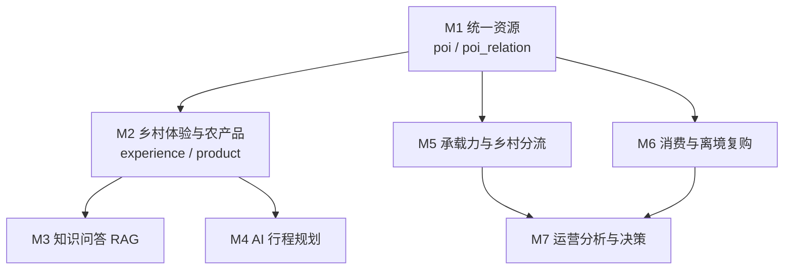

# 汉游智脑 · 模块划分与依赖关系

> 版本 v2 · 2026-09-23 · 随开发推进更新（v2：M2 完成，补 M2 接口与扩展点，修正 M1→M2 的依赖性质）

## 一、划分原则：纵切，不横切

每个模块是一条完整的竖线：

```
建表  →  后端接口  →  前端页面  →  前后端联调  →  验收  →  提交
```

上一模块验收通过后才启动下一模块。这样做的目的不是流程好看，而是避免
"前端全做完了、后端还没开始"这种跨模块半成品堆积——一旦某层返工，返工范围会扩散到所有模块。

配套三条纪律：

1. **不预建用不到的表**。数据库脚本按模块拆成 `db/V1__m1_*.sql`、`db/V2__m2_*.sql`，
   一个模块只建自己需要的表。表结构在真写接口时才定型，提前设计必然要改。
2. **切完即删 mock**。前端每个 mock 模块都对应一个后端模块，该模块落地后立即删除对应 mock，
   不留"两套数据源并存"的中间态。
   *执行记录*：M1 落地时保留了一半 mock（体验与产品仍读本地 `web/public/data/*.json`），
   因为那属于 M2 的范围；M2 落地时把 `api/citypack.ts` 里的 `loadLocal`、同步脚本
   `scripts/sync-citypack.mjs`、`web/public/data/` 与 `.gitignore` 里的对应条目一并删掉。
   现在前端唯一的数据来源是后端，后端唯一的数据来源是 `citypack/`。
3. **接口先留、页面后接**。后端接口的查询参数、关系类型按完整业务语义定义，
   即使当前前端没用到——否则后续模块要回头改接口，一改就牵动已验收的模块。

## 二、模块总览

| # | 模块 | 数据表 | 后端接口 | 前端页面 | 状态 |
|---|---|---|---|---|---|
| **M1** | 统一资源（POI） | `city_profile` `poi` `poi_relation` | `GET /api/city`<br>`GET /api/pois`<br>`GET /api/pois/{id}` | 探索页、资源详情页 | ✅ 已验收 |
| **M2** | 乡村体验与农产品 | `experience` `product` `product_category` | `GET /api/experiences`<br>`GET /api/experiences/{id}`<br>`GET /api/products`<br>`GET /api/products/{id}`<br>`GET /api/product-categories` | 详情页「乡村体验 / 乡村好物」、首页好物 | ✅ 已验收 |
| **M3** | 文旅知识问答（RAG） | Chroma `kb_city`（向量库，不占 MySQL） | `POST /ai/qa`（SSE，Java 代理） | AI 助手 · 知识问答 | 待开发 |
| **M4** | AI 行程规划（多智能体） | `trip_plan` `trip_plan_item` | `POST /ai/plan` + 轮询 | AI 助手 · 行程规划、我的行程 | 待开发 |
| **M5** | 承载力与乡村分流 | `poi_visit_stats` `risk_rule` `risk_event` `work_order` | `GET /api/ops/snapshot`<br>`GET /api/risks`<br>`GET /api/work-orders` | 管理端风险与工单页、详情页分流建议接真实承载 | 待开发 |
| **M6** | 消费与离境复购 | `visitor` `cart_item` `orders` `order_item` `trip_checkin` | `/api/cart` `/api/orders` `/api/repurchase` | 我的（足迹 / 订单 / 复购） | 待开发 |
| **M7** | 运营分析与决策 | 读 M5 / M6，不新建表 | `POST /api/ai/analyze/ops` | 驾驶舱接真实接口、AI 运营分析页 | 待开发 |

## 三、依赖关系

依赖是**单向的数据依赖**：下游读上游产出的数据，上游不感知下游。



关键依赖说明：

| 依赖 | 性质 | 说明 |
|---|---|---|
| M1 → M2 | **导入期引用约束** | `experience.poi_id`、`product.poi_id` 必须指向 M1 的 `poi`。**数据库没有建外键**（跨模块的表还会继续加，外键会让换城市时的全量重建变脆），改由 `CityPackImporter.validateReferences` 在导入前逐条校验，不通过就拒绝启动 |
| M1 → M5 | 数据依赖 | 承载统计挂在 `poi_id` 上；分流规则读 M1 的 `DIVERSION` 关系 |
| M1 → M6 | 数据依赖 | 订单项指向 `poi_id` / `experience_id`，足迹 `trip_checkin` 记录到访过的 `poi_id` |
| M5 → M1（反向） | **前端层依赖，非数据依赖** | 详情页的分流建议需要 M5 的真实承载力才能从"空间可承接"升级为"当前可承接"。M1 阶段先用仿真值过滤，接口不需要改 |
| M2 → M3 | 语料依赖 | RAG 的知识库内容来自资源、体验与产品的公开描述 |
| M2 → M4 | 选点依赖 | 行程规划的候选点集是 `poi` + `experience` |
| M5 / M6 → M7 | 数据依赖 | 运营分析只读这两者的数据，自身不产生业务数据 |

## 四、各模块职责边界与接口定义

### M1 统一资源（POI）

**做什么**
- 一张 `poi` 表承载景区 / 乡村 / 餐饮 / 住宿 / 交通 / 购物六类资源，靠 `business_type` 区分
- `poi_relation` 把孤立资源变成可查询的网络，四类关系由距离与业态规则计算生成
- City Pack 导入器：启动时读 `citypack/<city>/*.json` 灌库，换城市只换目录与环境变量

**不做什么**
- 不做承载统计（M5）、不做订单（M6）、不做行程（M4）
- 不存体验与产品（M2），`pois.json` 里的资源点之外的数据 M1 一律不碰

**接口**
| 方法 | 路径 | 参数 | 返回 |
|---|---|---|---|
| GET | `/api/city` | — | `CityMetaVO` |
| GET | `/api/pois` | `business_type` `district` `keyword`（均可选） | `PoiVO[]` |
| GET | `/api/pois/{id}` | — | `PoiDetailVO`（含四组关系） |

### M2 乡村体验与农产品

**做什么**
- `experience` 乡村体验项目：它是整条消费链的**锚点**，产品挂在它上面
- `product` 乡村农产品：数据库用 `CHECK (poi_id IS NOT NULL OR experience_id IS NOT NULL)`
  保证产品必须可追溯——库里不可能存在"孤立商品"，前端也就没有独立商城页面的数据基础
- `product_category` 分类，`parent_code` 留给后续二级分类
- 导入器在读取阶段把产品写的中文分类名解析成 `category_code`，并做引用自检

**不做什么**
- 不做独立商城页面（产品只出现在它所属的体验与乡村页面里）
- 不做订单、购物车与支付（M6）；不做库存扣减（M6 下单时才需要）

**接口**
| 方法 | 路径 | 参数 | 返回 |
|---|---|---|---|
| GET | `/api/experiences` | `poi_id` `type`（均可选） | `ExperienceVO[]` |
| GET | `/api/experiences/{id}` | — | `ExperienceVO` |
| GET | `/api/products` | `poi_id` `experience_id` `category_code` `keyword`（均可选） | `ProductVO[]` |
| GET | `/api/products/{id}` | — | `ProductVO` |
| GET | `/api/product-categories` | — | `ProductCategoryVO[]`（含 `product_count`） |

**为什么不提供 `/api/pois/{id}/products`**
规划里原本有这个嵌套路径，实现时去掉了：它和 `/api/products?poi_id=xxx` 是同一份数据的两条入口，
两处都要维护排序、过滤与名称补全，迟早会漂移。列表只保留一个，靠查询参数区分场景。
详情页因此发 3 个请求（资源详情 + 体验 + 产品）而不是 1 个——代价是两次额外往返，
换来的是 M2 的数据不渗进 M1 的 `PoiDetailVO`，两个模块的接口各归各管。

### M3 文旅知识问答（RAG）

**做什么**：Chroma 向量库 `kb_city`，检索 + 生成 + 自检（critique 回退重试）

**不做什么**：不做业务数据查询（那是 M5/M7 的规则与 SQL）；不连业务库

**接口**：`POST /ai/qa`（SSE 流式），Java 侧代理转发并做限流与鉴权

### M4 AI 行程规划（多智能体）

**做什么**：LangGraph 多 Agent 协同产出多日行程；结果落 `trip_plan` / `trip_plan_item`

**不做什么**：不做承载判定（交给 M5 规则引擎，Agent 只消费结论）

**接口**：`POST /ai/plan`（异步任务）+ `GET /api/trip-plans/{taskId}`（轮询）

### M5 承载力与乡村分流

**做什么**：客流时序统计、风险规则引擎（6 条规则）、风险事件与工单闭环

**不做什么**：不做 LLM 判定——判定用规则（确定性、可解释），生成与解释用 LLM，边界不越

**接口**：`GET /api/ops/snapshot`、`GET /api/risks`、`GET /api/work-orders`

### M6 消费与离境复购

**做什么**：购物车、订单（`channel` 区分 TRIP / REPURCHASE）、旅行足迹 `trip_checkin`

**不做什么**：不做真实支付；不做物流

**接口**：`/api/cart`、`/api/orders`、`/api/repurchase`

### M7 运营分析与决策

**做什么**：读 M5 / M6 数据做聚合与 AI 解读，输出可执行建议

**不做什么**：不新建业务表；不做写操作

**接口**：`POST /api/ai/analyze/ops`

## 五、为后续模块预留的接口

### M1 留出的扩展点

M1 在实现时特意留出的扩展点，后续模块可直接用，不需要回头改 M1：

| 预留点 | 给谁用 | 怎么用 |
|---|---|---|
| `poi_relation` 的 `DIVERSION` 关系 | M5 分流规则 | 规则引擎读这批边作为分流候选，再叠加真实承载过滤 |
| `poi_relation.weight` | M4 行程规划 | 选点排序用，距离越近权重越高 |
| `/api/pois` 的 `business_type` / `district` / `keyword` 参数 | M4、M5 | 行程选点按业态挑、运营分析按区县聚合 |
| `poi.capacity` | M5 承载率计算 | 承载率 = 实际客流 / capacity |
| `poi.status` | M5、M7 | 下架资源不进统计，也不出现在列表 |
| City Pack 目录与 `CITY_PACK` 环境变量 | 全部 | 换城市零改代码 |
| Jackson 全局 snake_case | 全部 | 后续 entity 的驼峰字段自动输出成前端认得的名字，不需要逐字段写 `@JsonProperty` |
| `PoiService` 接口 | M2–M7 | 新模块注入该接口取资源，不直接碰 Mapper |

### M2 留出的扩展点

| 预留点 | 给谁用 | 怎么用 |
|---|---|---|
| `product.category_code` | M4、M7 | 行程规划按"带点茶叶回去"挑伴手礼、运营分析按分类聚合。**用编码而不是中文名**——中文名会被改，筛选条件会整批失效 |
| `/api/products` 的 `experience_id` / `category_code` / `keyword` 参数 | M4、M6、M7 | M2 前端只用到了 `poi_id`，其余三个参数先留着 |
| `ProductVO.experience_name` / `poi_name` | 前端、M6 | "这一款来自哪次体验"是核心信息，由后端补全。M6 的复购页要按体验组织订单，同样直接用 |
| `ExperienceVO.poi_name` | 前端、M4 | 体验列表不查第二次就能显示所属乡村 |
| `experience.capacity` / `experience.season` | M4、M5 | 行程排期要判断体验是否当期可预约、单场能不能容下这批人 |
| `product.stock` | M6 | 下单时才扣，M2 只存不扣 |
| `product_category.parent_code` | 后续 | 二级分类，当前数据只有一级 |
| `NameResolver` 组件 | M4–M7 | id → 名称的批量补全（乡村名 / 体验名 / 分类名），一次查询分发，不在循环里逐个查 |
| `VoUtils` | M2–M7 | 逗号分隔字符串转数组、DECIMAL 转 Double 的统一口径，避免各接口对同一列给出不同格式 |
| `CityPackImporter.validateReferences` | 全部 | 新增表时在这里加一条引用检查，坏数据包在启动阶段就被拦住 |
| `db/V*.sql` 按模块拆分 | 全部 | 一个模块一个脚本，重放与回滚范围清晰 |
